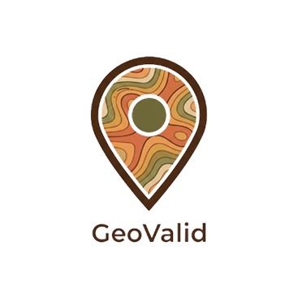
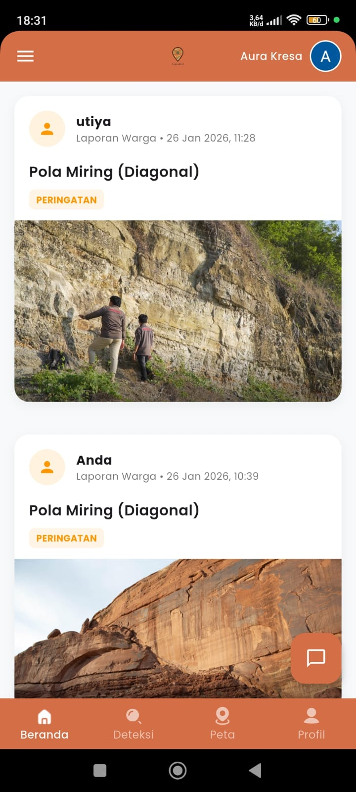
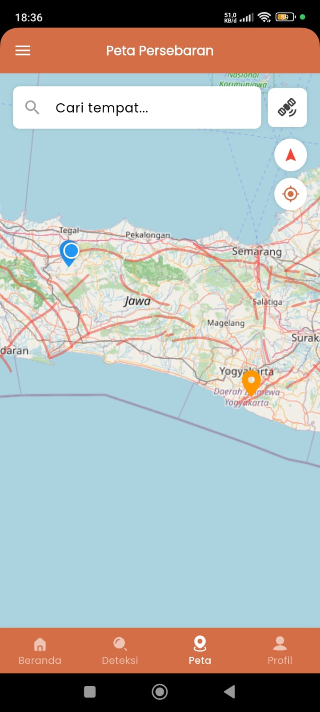
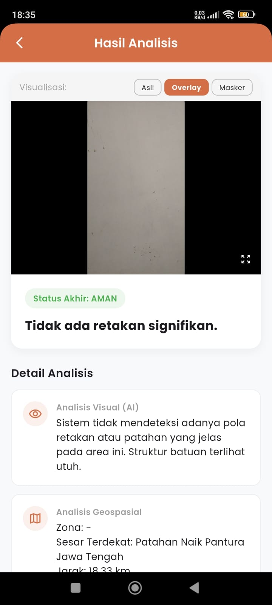
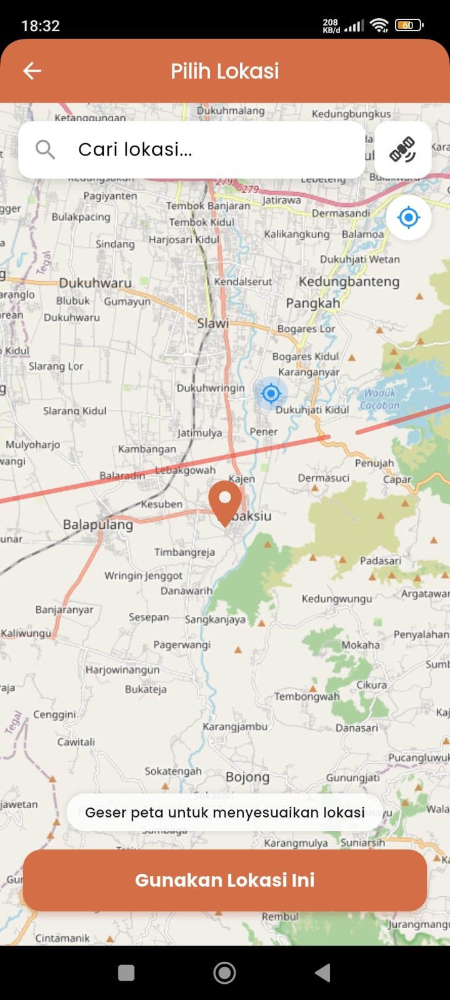
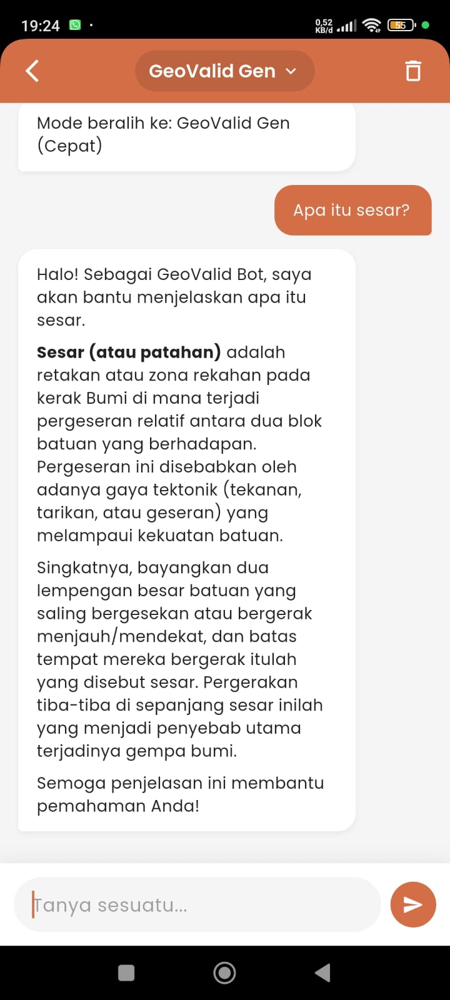
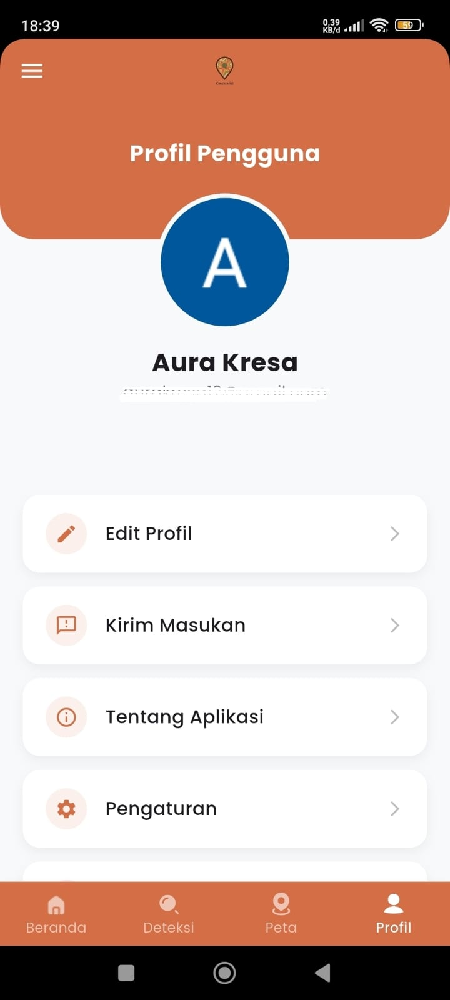
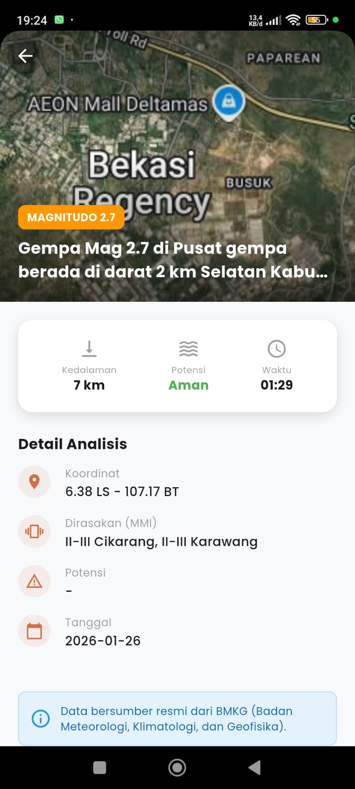

<div align="center">

  

# GeoValid: AI-Powered Fault Detection System

**Sistem Deteksi Dini & Pemetaan Sesar Bumi Berbasis Crowdsourcing dan Kecerdasan Buatan**

[](https://flutter.dev/)
[](https://dart.dev/)
[](https://supabase.com/)
[](https://riverpod.dev/)

  <p align="center">
    <a href="#-about-the-project">About</a> •
    <a href="#-key-features">Key Features</a> •
    <a href="#-app-previews">Screenshots</a> •
    <a href="#-tech-stack">Tech Stack</a> •
    <a href="#-getting-started">Getting Started</a>
  </p>
</div>

---

##  About The Project

**GeoValid** adalah aplikasi mobile inovatif yang bertujuan untuk meningkatkan kesadaran dan mitigasi bencana geologi. Aplikasi ini memberdayakan pengguna untuk menjadi "sensor" di lapangan dengan memindai formasi batuan yang dicurigai sebagai jalur sesar (patahan) aktif.

Menggunakan teknologi **Deep Learning**, aplikasi ini menganalisis citra visual batuan dan memvalidasinya dengan data geospasial. GeoValid tidak hanya memetakan potensi bahaya, tetapi juga menyediakan edukasi geologi dan informasi gempa terkini secara *real-time*.

##  Key Features

* **AI Fault Detection:** Analisis instan citra batuan/tebing menggunakan kamera smartphone untuk mendeteksi jejak sesar aktif dengan visualisasi canggih (Overlay & Masking).
* **Interactive Hazard Map:** Peta interaktif yang menampilkan jalur patahan aktif (GeoJSON) dan riwayat deteksi pengguna dengan filter visualisasi (Satelit/Jalan).
* **Precision Location Picking:** Penentuan lokasi deteksi yang akurat menggunakan GPS dan fitur pencarian lokasi cerdas.
* **Earthquake Info Hub:** Integrasi data gempa terkini (BMKG) yang disajikan dalam feed yang informatif.
* **Geo-Assistant Chatbot:** Asisten cerdas untuk menjawab pertanyaan seputar geologi, mitigasi bencana, dan penggunaan aplikasi.
* **Secure Authentication:** Sistem login dan manajemen profil pengguna yang aman menggunakan Supabase Auth.

## App Previews

| **Home Dashboard** | **AI Detection** | **Interactive Maps** | **Analysis Result** |
|:---:|:---:|:---:|:---:|
|  |  |  |  |
| *Real-time feeds & updates* | *Camera & Gallery Input* | *Active Fault Visualization* | *AI Overlay & Risk Status* |

| **Location Picker** | **Chatbot** | **User Profile** | **BMKG Detail** |
|:---:|:---:|:---:|:---:|
|  |  |  |  |
| *Precision Pinpointing* | *Smart Assistant* | *History & Settings* | *Detailed Quake Info* |

## 🛠️ Tech Stack & Architecture

Aplikasi ini dibangun menggunakan prinsip **Clean Architecture** dan **Feature-First Structure** untuk memastikan skalabilitas, kemudahan maintenance, dan performa tinggi.

* **Frontend Framework:** [Flutter](https://flutter.dev/) (Dart)
* **State Management:** [Flutter Riverpod](https://riverpod.dev/) (Untuk manajemen state yang reaktif dan testable)
* **Backend as a Service:** [Supabase](https://supabase.com/) (PostgreSQL, Auth, Storage)
* **Routing:** [GoRouter](https://pub.dev/packages/go_router) (Manajemen navigasi berbasis URL)
* **Maps & GIS:** [Flutter Map](https://pub.dev/packages/flutter_map), Latlong2, Geolocator
* **Networking:** HTTP, Dio (Implied)
* **Architecture Pattern:** MVVM (Model-View-ViewModel) with Repository Pattern.

### Folder Structure Overview
```bash
lib/
├── core/            # Core logic (Constants, Routing, Services, Utils)
├── features/        # Feature-based modules
│   ├── auth/        # Authentication (Login, Register)
│   ├── detection/   # AI Camera & Result processing
│   ├── home/        # Dashboard & Feeds
│   ├── maps/        # GIS Visualization
│   ├── chatbot/     # AI Chat Assistant
│   └── profile/     # User Management
├── l10n/            # Localization (ID/EN)
└── main.dart        # Entry point